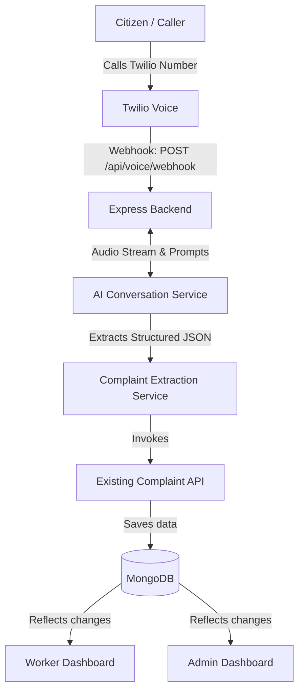

# Sahayog 24x7: AI Voice Complaint Registration System Specification

This document provides a complete technical specification for implementing an AI-powered voice complaint registration system in the **Sahayog 24x7** project. 

The goal of this system is to enable citizens to dial a Twilio Voice Number and register utility complaints by speaking naturally to an AI assistant, completely bypassing the web interface.

---

## 1. System Overview & Goal

*   **Goal**: Provide a zero-friction, natural language telephony channel for citizens to file utility complaints.
*   **Telephony Channel**: Powered by a purchased Twilio Voice Number.
*   **Interaction Model**: Conversational AI (replacing traditional keypad-based IVR systems) using speech-to-text, natural language processing, and text-to-speech technologies.
*   **Data Consistency**: Reuse the existing backend API, models, and MongoDB collections.

---

## 2. Functional Requirements

### 2.1 Citizen Identification Flow

The conversation begins by identifying the caller. The assistant will search the MongoDB database to see if the user is registered.

1.  **Welcome**: Welcome the caller to Sahayog 24x7.
2.  **Prompt Identification**: Ask the caller for their **Consumer ID** or **Registered Mobile Number**.
3.  **Database Lookup**: Search the database:
    *   If a match is found: Retrieve the citizen's details and auto-fill `Name`, `Phone Number`, and `Consumer ID`.
    *   If no match is found: Proceed in **Guest Mode** and prompt the caller to speak their `Name` and `Mobile Number`.

---

### 2.2 Address Collection Flow

To ensure complaint data aligns with the website structure, the AI must collect geographical information based on the citizen's location type.

The AI will first ask:
> *"Is your location Urban or Rural?"*

Based on the response, it will collect the corresponding fields:

| Urban Address Fields | Rural Address Fields |
| :--- | :--- |
| **District** (Required) | **District** (Required) |
| **Municipality** (Required) | **Block / Sub-Division** (Required) |
| **Ward Number** (Required) | **Gram Panchayat** (Required) |
| **Locality / Road** (Required) | **Village** (Required) |
| **House / Plot Number** (Optional) | **Locality / Road** (Required) |
| **PIN Code** (Required) | **House Number** (Optional) |
| | **PIN Code** (Required) |

*Note: The AI must extract these fields from natural speech. If any required fields are missing from the caller's response, the AI should specifically prompt only for the missing field.*

---

### 2.3 Complaint Details & Classification

The AI must identify the type of issue from the user's natural explanation.

#### Allowed Issue Types:
The AI is restricted to classifying complaints into one of these six categories:
*   `Power Outage`
*   `Low Voltage`
*   `Sparking / Hazard`
*   `Meter Fault`
*   `Transformer Issue`
*   `Billing Issue`

#### Classification Logic:
*   **Example**: User says, *"My lights went out and my neighbors don't have power either."* $\rightarrow$ Classify as `Power Outage`.
*   **Confirmation**: If the AI cannot confidently classify the complaint, it should ask the caller for confirmation: *"It sounds like you are experiencing a Power Outage. Is that correct?"*
*   **Description**: Finally, the AI will ask the user to describe the issue in detail and record this as the `Complaint Description`.

---

### 2.4 Confirmation & API Submission

Before saving, the AI must summarize the collected information and ask for verification.

1.  **Summary**: Read back the summarized details:
    *   *Name*
    *   *Phone Number*
    *   *Address*
    *   *Issue Type*
    *   *Description*
2.  **Confirm Question**: Ask, *"Is this information correct?"*
    *   If **Yes**: Submit the complaint.
    *   If **No**: Allow the user to correct the fields.
3.  **API Integration**: Submit the data to the existing backend API endpoint (`POST /api/complaints`). Do **not** create a separate database or collection.

---

### 2.5 Completion

After the complaint is successfully created in MongoDB:
1.  Retrieve the generated `Complaint ID`.
2.  Read the ID back to the caller clearly.
    *   **Example Speech**: *"Your complaint has been registered successfully. Your Complaint ID is CMP-2026-000123. Thank you for calling Sahayog 24x7."*
3.  Terminate the call.

---

## 3. Technical Architecture

The following diagram illustrates how the voice system integrates into the existing Sahayog 24x7 stack:



---

## 4. Suggested Backend Structure

The voice system code should be organized cleanly under the existing `backend` workspace to preserve modularity:

```text
backend/
├── src/
│   ├── controllers/
│   │   ├── voiceController.js          # Handles Twilio TwiML callbacks
│   │   └── complaintController.js      # Existing controller
│   ├── routes/
│   │   └── voice.js                    # Router for /api/voice/* endpoints
│   ├── services/
│   │   ├── twilioService.js            # Twilio SDK helpers
│   │   ├── aiConversationService.js    # Manages OpenAI Realtime/Audio session
│   │   └── complaintExtractionService.js # Extracts structured JSON using GPT
│   ├── utils/
│   │   └── addressParser.js            # Standardizes voice addresses
│   ├── middleware/
│   └── models/
```

---

## 5. Required Environment Variables

Add these to your `backend/.env` file:

```env
# Twilio Telephony Credentials
TWILIO_ACCOUNT_SID=ACXXXXXXXXXXXXXXXXXXXXXXXXXXXXXXXX
TWILIO_AUTH_TOKEN=your_twilio_auth_token
TWILIO_PHONE_NUMBER=+1234567890

# OpenAI API for Voice Synthesis and Extraction
OPENAI_API_KEY=sk-proj-XXXXXXXXXXXXXXXXXXXXXXXXXXXXXXXX

# Existing variables
MONGODB_URI=mongodb+srv://...
JWT_SECRET=your_jwt_secret
```

---

## 6. Implementation Phases

```text
Phase 1: Twilio Integration
   └── Configure webhook URLs, verify credentials, and handle basic call routing.

Phase 2: Receive Calls
   └── Handle incoming calls and return standard TwiML instructions to speak.

Phase 3: AI Conversation
   └── Set up the OpenAI stream or Assistant API to carry out voice dialogues.

Phase 4: Citizen Identification
   └── Extract phone number/ID from speech, query MongoDB, and welcome the user.

Phase 5: Address Collection
   └── Prompt for Urban/Rural details and extract structured geographic fields.

Phase 6: Complaint Classification
   └── Map user's description of their issue to one of the 6 allowed types.

Phase 7: Complaint Creation
   └── Map variables to the existing schema and call the database save methods.

Phase 8: Confirmation
   └── Read a summary of the details to the caller and accept corrections.

Phase 9: Read Complaint ID
   └── Parse the database response and read the generated Complaint ID.
```

---

## 7. Security & Resiliency

*   **Input Validation**: Sanitize all text extracted from speech before running database queries to prevent injection attacks.
*   **Rate Limiting**: Limit the frequency of calls from the same phone number to prevent telephony resource exhaustion.
*   **Secure API Keys**: Never expose the Twilio token or OpenAI key to client apps; all telephony logic must be run entirely on the backend.
*   **Error Handling & Retry**: If the AI speech-to-text fails to understand the caller, repeat the question politely up to 3 times before forwarding to a human operator or registering a generic complaint.
*   **Conversation Logging**: Store transcript logs in MongoDB linked to the complaint for auditability.

---

## 8. Future Enhancements

*   **Multilingual Support**: Add language selection (Bengali, Hindi, English) at the beginning of the call to support regional dialects.
*   **Voice Biometrics**: Use voiceprint analysis for secure password-less verification of registered citizens.
*   **Status Inquiries**: Allow callers to check the status of existing complaints via phone: *"Check status of CMP-2026-000123"*.
*   **AI Callback**: If all repair teams are occupied, schedule an automated callback to the user once the status is updated to `IN_PROGRESS` or `COMPLETED`.
*   **Emergency Priority Detection**: Use acoustic analysis or sentiment detection to identify highly stressed callers (e.g. wire spark hazards) and automatically flag the priority as `high`.
